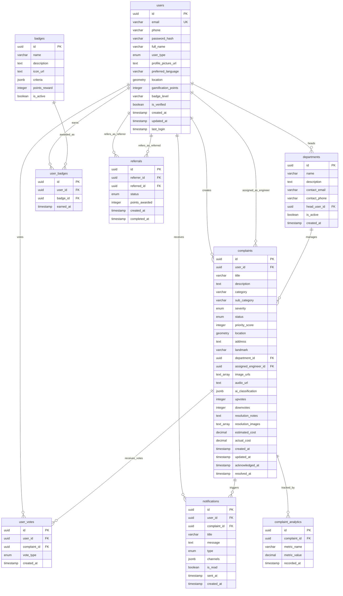

# Entity Relationship Diagram
## Crowdsourced Civic Issue Reporting System

### Database ER Diagram

### Relationship Details

#### One-to-Many Relationships:
1. **users → complaints**: A user can create multiple complaints
2. **users → user_votes**: A user can vote on multiple complaints
3. **users → notifications**: A user can receive multiple notifications
4. **users → user_badges**: A user can earn multiple badges
5. **departments → complaints**: A department can handle multiple complaints
6. **complaints → user_votes**: A complaint can receive multiple votes
7. **complaints → notifications**: A complaint can trigger multiple notifications
8. **complaints → complaint_analytics**: A complaint can have multiple analytics records
9. **badges → user_badges**: A badge can be earned by multiple users

#### Special Relationships:
1. **users → departments**: A user can head a department (head_user_id)
2. **users → complaints**: A user can be assigned as field engineer (assigned_engineer_id)
3. **users → referrals**: Self-referencing relationship for referrer and referred users

#### Many-to-Many Relationships (through junction tables):
1. **users ↔ badges**: Through user_badges table
2. **users ↔ complaints**: Through user_votes table (voting relationship)

### Key Constraints:
- Each user can vote only once per complaint (unique constraint on user_id, complaint_id in user_votes)
- Each user can earn each badge only once (unique constraint on user_id, badge_id in user_badges)
- Email addresses must be unique across all users
- Geospatial data uses PostGIS GEOMETRY type for location tracking